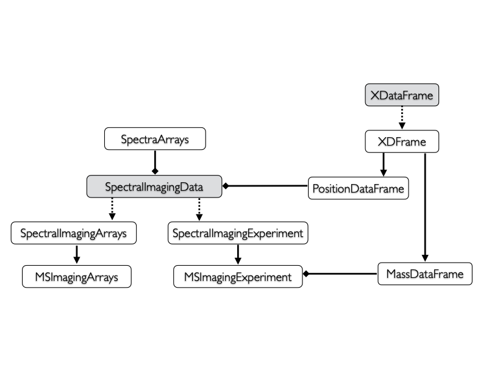

```{r style, echo=FALSE, results='asis'}
BiocStyle::markdown()
```

```{r setup, echo=FALSE, message=FALSE}
library(Cardinal)
```

# Introduction 

## Latest: Cardinal 3.6

*Cardinal 3.6* is a major update with breaking changes. It bring support many of the new low-level signal processing functions implemented for *matter 2.4* and *matter 2.6*. Almost the entire *Cardinal* codebase has been refactored to support these improvements.

The most notable of the new features include:

- Redesign class hierarchy that includes a greater emphasis on spectra: `SpectralImagingData`, `SpectralImagingArrays`, and `SpectralImagingExperiment` lay the groundwork for the new data structures

- Updated `MSImagingExperiment` class with a new counterpart `MSImagingArrays` class for better representing raw spectra.

- New spectral processing methods in `smooth()`:

  + Improved Gaussian filtering
  + Bilateral and adaptive bilateral filtering
  + Nonlinear diffusion filtering
  + Guided filtering
  + Peak-aware guided filtering
  + Savitsky-Golay smoothing

- New spectral baseline reduction methods in `reduceBaseline()`:

  + Interpolation from local minima
  + Convex hull estimation
  + Sensitive nonlinear iterative peak (SNIP) clipping
  + Running medians

- New spectral alignment methods in `recalibrate()`:

  + Local maxima-based alignment using local regression
  + Dynamic time warping
  + Correlation optimized warping

- New peak picking methods in `peakPick()`:

  + Derivative-based noise estimation
  + Quantile-based noise estimation
  + SD/MAD-based noise estimatino
  + Dynamic peak filtering
  + Continuous wavelet transform (CWT)

- Improved `image()` contrast enhancement via `enhance`:

  + Improved histogram equalization
  + Contrast-limited adaptive histogram equalization (CLAHE)

- Improved `image()` spatial smoothing via `smooth`:

  + Improved Gaussian filtering
  + Bilateral and adaptive bilateral filtering
  + Nonlinear diffusion filtering
  + Guided filtering

- All statistical methods improved and updated

  + New and improved `crossValidate()` method
  + New dimension reduction method `NMF()`
  + Updated `PCA()` and `spatialFastmap()`
  + Updated `PLS()` and `OPLS()` with new algorithms
  + Updated `spatialKMeans()` with better initializations
  + Updated `spatialShrunkenCentroids()` with better initializations
  + Updated `spatialDGMM()` with improved stability
  + Updated `meansTest()` with improved data preparation
  + New `SpatialResults` output with simplified interface

And many other updates! Many redundant functions and methods have been merged to simplify and streamline workflows. Many unnecessary functions and methods have been deprecated.

Major improvements from earlier versions are further described below.

## Previous updates from Cardinal 3

*Cardinal 3* lays the groundwork for future improvements to the existing toolbox of pre-processing, visualization, and statistical methods for mass spectrometry (MS) imaging experiments. *Cardinal* has been updated to support *matter 2*, and legacy support has been dropped.

Despite minimal user-visible changes in *Cardinal* (at first), the entire *matter* package that provides the backend for *Cardinal*'s computing on larger-than-memory MS imaging datasets has been rewritten. This should provide more robust support for larger-than-memory computations, as well as greater flexibility in handling many data files in the future.

Further changes will be coming soon to *Cardinal 3* in future point updates that are aimed to greatly improve the user experience and simplify the code that users need to write to process and analyze MS imaging data.

Major improvements from earlier versions are further described below.

## Previous updates from Cardinal 2

*Cardinal 2* provides new classes and methods for the manipulation, transformation, visualization, and analysis of imaging experiments--specifically MS imaging experiments.

MS imaging is a rapidly advancing field with consistent improvements in instrumentation for both MALDI and DESI imaging experiments. Both mass resolution and spatial resolution are steadily increasing, and MS imaging experiments grow increasingly complex.

The first version of *Cardinal* was written with certain assumptions about MS imaging data that are no longer true. For example, the basic assumption that the raw spectra can be fully loaded into memory is unreasonable for many MS imaging experiments today.

*Cardinal 2* was re-written from the ground up to handle the evolving needs of high-resolution MS imaging experiments. Some advancements include:

- New imaging experiment classes such as `ImagingExperiment`, `SparseImagingExperiment`, and `MSImagingExperiment` provide better support for out-of-memory datasets and a more flexible representation of complex experiments

- New imaging metadata classes such as `PositionDataFrame` and `MassDataFrame` make it easier to manipulate experimental runs, pixel coordinates, and *m/z*-values by storing them as separate slots rather than ordinary columns

- New `plot()` and `image()` visualization methods that can handle non-gridded pixel coordinates and allow assigning the resulting plot (and data) to a variable for later re-plotting

- Support for writing imzML in addition to reading it; more options and support for importing out-of-memory imzML for both *"continuous"* and *"processed"* formats

- Data manipulation and summarization verbs such as `subset()`, `aggregate()`, and `summarizeFeatures()`, etc. for easier subsetting and summarization of imaging datasets

- Delayed pre-processing via a new `process()` method that allows queueing of delayed pre-processing methods such as `normalize()` and `peakPick()` for later execution

- Parallel processing support via the *BiocParallel* package for all pre-processing methods and any statistical analysis methods with a `BPPARAM` option

Classes from older versions of Cardinal should be coerced to their *Cardinal 2* equivalents. For example, to return an updated `MSImageSet` object called `x`, use `as(x, "MSImagingExperiment")`.


# Installation

*Cardinal* can be installed via the *BiocManager* package.

```{r install, eval=FALSE}
install.packages("BiocManager")
BiocManager::install("Cardinal")
```

The same function can be used to update *Cardinal* and other Bioconductor packages.

Once installed, *Cardinal* can be loaded with `library()`:

```{r library, eval=FALSE}
library(Cardinal)
```


# Data import

*Cardinal* natively supports reading and writing imzML (both "continuous" and "processed" types) and Analyze 7.5 formats via the `readMSIData()` and `writeMSIData()` functions.

The imzML format is an open standard designed specifically for interchange of mass spectrometry imaging datasets. Vendor-specific raw formats can be converted to imzML with the help of free applications available online at [](http://www.imzml.org).

## Reading "continuous" imzML

We can read an example of a "continuous" imzML file from the `CardinalIO` package:

```{r read-imzML-continuous}
path_continuous <- CardinalIO::exampleImzMLFile("continuous")
path_continuous
mse_tiny <- readMSIData(path_continuous)
mse_tiny
```

A "continuous" imzML file contains mass spectra where all of the spectra have the same *m/z* values. It is returned as an `MSImagingExperiment` object, which contains both the spectra and the experimental metadata.


## Reading "processed" imzML

We can also read an example of a "processed" imzML file from the `CardinalIO` package:

```{r read-imzML-processed}
path_processed <- CardinalIO::exampleImzMLFile("processed")
path_processed
msa_tiny <- readMSIData(path_processed)
msa_tiny
```

A "processed" imzML file contains mass spectra where each spectrum has its own *m/z* values. Despite the name, it can still contain profile spectra. For "processed" imzML, the data is returned as an `MSImagingArrays` object.


# Data structures for MS imaging

*Cardinal 3.6* introduces a simple set of new data structures for organizing data from MS imaging experiments.



- `SpectraArrays`: Storage for high-throughput spectra

- `SpectralImagingData`: Virtual container for spectral imaging data, i.e., spectra with spatial metadata

- `MSImagingArrays`: Specializes `SpectralImagingData` (via `SpectralImagingExperiment`)  for representing raw mass spectra where each spectrum has its own *m/z* values

- `MSImagingExperiment`: Specializes `SpectralImagingData` (via `SpectralImagingArrays`)  for representing mass spectra where all spectra have the same *m/z* values

These are further explored in the next sections.


## `MSImagingArrays`: Mass spectra with differing *m/z* values

In *Cardinal*, mass spectral data with differing *m/z* values are stored in `MSImagingArrays` objects.

```{r show-MSImagingArrays}
msa_tiny
```

An `MSImagingArrays` object is conceptually a list of mass spectra with a companion data frame of spectrum-level pixel metadata.

This dataset contains 9 mass spectra. It can be subset like a list:

```{r subset-MSImagingArrays}
msa_tiny[1:3]
```

### Accessing spectra arrays with `spectraData()`

The spectral data can be accessed with `spectraData()`.

```{r spectraData-MSImagingArrays}
spectraData(msa_tiny)
```

The list of spectral data arrays are stored in a `SpectraArrays` object. An `MSImagingArrays` object must have at least two arrays named "mz" and "intensity", which are lists of the m/z arrays and intensity arrays.

The `spectra()` accessor can be used to access specific spectra arrays.

```{r spectra-accessor}
spectra(msa_tiny, "mz")
spectra(msa_tiny, "intensity")
```

Alternatively, we can use the `mz()` and `intensity()` accessors to get these specific arrays.

```{r intensity-accessor}
mz(msa_tiny)
intensity(msa_tiny)
```

Note that the full spectra are not fully loaded into memory. Instead, they are represented as out-of-memory `matter` lists. For the most part, these lists can be treated as ordinary R lists, but the spectra are only loaded from storage on-the-fly as they are accessed.

### Accessing pixel metadata with `pixelData()`

The spectrum-level pixel metadata can be accessed with `pixelData()`. Alternatively, `pData()` is a shorter alias that does the same thing.

```{r pixelData-MSImagingArrays}
pixelData(msa_tiny)
pData(msa_tiny)
```

The pixel metadata is stored in a `PositionDataFrame`, with a row for each mass spectrum in the dataset. This data frame stores position information, run information, and all other spectrum-level metadata.

The `coord()` accessor retrieves the columns giving the positions of the spectra.

```{r coord-accessor}
coord(msa_tiny)
```

Use `runNames()` to access the names of the experimental runs (by default set to the file name) and `run()` to access the run for each spectrum.


```{r run-accessor}
runNames(msa_tiny)
head(run(msa_tiny))
```

This data frame is also used to store any other spectrum-level metadata or statistical summaries.


## `MSImagingExperiment`: Mass spectra with shared *m/z* values

In *Cardinal*, mass spectral data with the same *m/z* values are stored in `MSImagingExperiment` objects.

```{r show-MSImagingExperiment}
mse_tiny
```

An `MSImagingExperiment` object is conceptually a matrix where the mass spectra are columns. The rows represent the flattened images for each mass feature.

This dataset contains 9 mass spectra each with the same 8,399 *m/z* values. It can be subset like a matrix:

```{r subset-MSImagingExperiment}
mse_tiny[1:500, 1:3]
```

For an `MSImagingExperiment`, the spectral data are stored as a single matrix of intensities that can be accessed with `spectra()`.

```{r spectraData-MSImagingExperiment}
spectraData(mse_tiny)
spectra(mse_tiny)
```
The spectrum-level pixel metadata is accessible via `pixelData()` just like `MSImagingArrays`.

```{r pixelData-MSImagingExperiment}
pixelData(mse_tiny)
```

The primary difference between `MSImagingExperiment` and `MSImagingArrays` is that that all of spectra share the same *m/z* values, so `MSImagingExperiment` can store feature metadata.


### Accessing feature metadata with `featureData()`

The feature metadata can be accessed with `featureData()`. Alternatively, `fData()` is a shorter alias that does the same thing.

```{r featureData-accessor}
featureData(mse_tiny)
fData(mse_tiny)
```

Because all of the mass spectra share the same *m/z* values, a single vector of *m/z* values can be accessed using `mz()`.

```{r mz-accessor}
head(mz(mse_tiny))
```

This data frame is also used to store any other feature-level metadata or statistical summaries.


### Building from scratch

Typically data is read into R using `readMSIData()`, but sometimes it is necessary to build a `MSImagingExperiment` object from scratch. This may be necessary if trying to import data formats other than imzML or Analyze 7.5.

```{r constructor}
set.seed(2020, kind="L'Ecuyer-CMRG")
s <- simulateSpectra(n=9, npeaks=10, from=500, to=600)

coord <- expand.grid(x=1:3, y=1:3)
run <- factor(rep("run0", nrow(coord)))

fdata <- MassDataFrame(mz=s$mz)
pdata <- PositionDataFrame(run=run, coord=coord)

out <- MSImagingExperiment(spectraData=s$intensity,
	featureData=fdata,
	pixelData=pdata)
out
```

For loading other data formats into R, `read.csv()` and `read.table()` can be used to read CSV and tab-delimited text files, respectively.

Likewise, `write.csv()` and `write.table()` can be used to write pixel metadata and feature metadata after coercing them to an ordinary R `data.frame` with `as.data.frame()`.

Use `saveRDS()` and `readRDS()` to save and read and entire R object such as a `MSImagingExperiment`. Note that if intensity data is to be saved as well, it should be pulled into memory and coerced to an R matrix with `as.matrix()` first. However, it is typically better to write an imzML file using `writeMSIData()`.


# Visualization

Visualization of mass spectra and molecular ion images is vital for exploratory analysis of MS imaging experiments. *Cardinal* provides `plot()` methods for plotting mass spectra and a`image()` methods for plotting images.

We will use simulated data for visualization. We will create versions of the dataset represented as both `MSImagingArrays` and `MSImagingExperiment`.

```{r simulate}
# Simulate an MSImagingExperiment
set.seed(2020, kind="L'Ecuyer-CMRG")
mse <- simulateImage(preset=6, dim=c(32,32), baseline=0.5)
mse

# Create a version as MSImagingArrays
msa <- convertMSImagingExperiment2Arrays(mse)
msa
```

## Visualizing spectra with `plot()`

Use `plot()` to plot mass spectra from a `MSImagingArrays` or `MSImagingExperiment` object. Below we plot the 463rd and 628th mass spectra in the dataset.

```{r plot-i, fig.height=3, fig.width=9}
plot(msa, i=c(496, 1520))
```

Alternatively, we can specify the coordinates.

```{r plot-coord, fig.height=3, fig.width=9}
plot(msa, coord=list(x=16, y=16))
```

We can use `superpose` to overlay the mass spectra and `xlim` to control the mass range.

```{r plot-superpose, fig.height=3, fig.width=9}
plot(msa, i=c(496, 1520), xlim=c(1000, 1250),
	superpose=TRUE)
```

## Visualizing images with `image()`

Use `image()` to plot ion images from `MSImagingExperiment`.  Below we plot the image for the 2,489th m/z value.

```{r image-i, fig.height=4, fig.width=9}
image(mse, i=1938)
```

Alternatively, we can specify the m/z value. The closest matching m/z value will be used.

```{r image-mz, fig.height=4, fig.width=9}
image(mse, mz=1003.3)
```

Use `tolerance` to sum together the images for a all *m/z* values within a certain tolerance.

```{r image-plusminus, fig.height=4, fig.width=9}
image(mse, mz=1003.3, tolerance=0.5, units="mz")
```

By default, images from all experimental runs are plotted. Use `run` to specify specific runs to plot by name or index.

```{r image-run, fig.height=4, fig.width=5}
image(mse, mz=1003.3, run="runA1")
```

Alternatively, use `subset` to plot an arbitrary subset of pixels.

```{r image-subset, fig.height=4, fig.width=9}
image(mse, mz=1003.3, subset=mse$circleA | mse$circleB)
```

Multiplicative variance in spectral intensities can cause images to be noisy and dark due to hot spots.

Often, images may require some type of processing and enhancement to improve interpretation.

```{r image-smooth, fig.height=4, fig.width=9}
image(mse, mz=1003.3, smooth="gaussian")
```

```{r image-contrast, fig.height=4, fig.width=9}
image(mse, mz=1003.3, enhance="histogram")
```

Multiple images can be superposed with `superpose=TRUE`. Use `scale=TRUE` to rescale all images to the same intensity range.

```{r image-superpose, fig.height=4, fig.width=9}
image(mse, mz=c(1003.3, 1663.6), superpose=TRUE,
	enhance="adaptive", scale=TRUE)
```


## Region-of-interest selection

Use `selectROI()` to select regions-of-interest on an ion image. It is important to specify a subset so that selection is only made on a single experimental run, otherwise results may be unexpected. The form of `selectROI()` is the same as `image()`.

```{r select-ROI, eval=FALSE}
sampleA <- selectROI(mse, mz=1003.3, subset=run(mse) == "run0")
sampleB <- selectROI(mse, mz=1003.3, subset=run(mse) == "run1")
```
`selectROI()` returns a logical vector specifying which pixels from the imaging experiment are contained in the selected region.

`makeFactor()` can then be used to combine multiple logical vectors (e.g., from `selectROI()`) into a single factor.

```{r makeFactor, eval=FALSE}
regions <- makeFactor(A=sampleA, B=sampleB)
```


## Saving plots and images

Plots and images can be saved to a file by using R's built-in graphics devices.

Use `pdf()` to initialize a PDF graphics device, create the plot, and then use `dev.off()` to turn off the graphics device.

Any plots printed while the graphics device is active will be saved to the specified file(s).


```{r pdf, eval=FALSE}
pdffile <- tempfile(fileext=".pdf")

pdf(file=pdffile, width=9, height=4)
image(mse, mz=1003.3)
dev.off()
```

Graphics devices for `png()`, `jpeg()`, `bmp()`, and `tiff()` are also available. See their documentation for usage.


## Dark themes

While many software for MS imaging data use a light-on-dark theme, *Cardinal* uses a dark-on-light theme by default. However, a dark theme is also provided with `style="dark`.

```{r style-dark, fig.height=4, fig.width=9}
image(mse, mz=1003.3, style="dark")
```


## A note on plotting speed

While plotting spectra should typically be fast, plotting images can be be (much) slower for large out-of-memory datasets.

This is due to the way the spectra are stored in imzML and Analyze files. Exracting the images simply takes longer than reading the spectra.

For the fastest visualization of images, experiments should be coerced to an in-memory matrix.

Also note that all *Cardinal* visualizations produce a `plot()`-able object that can be assigned to a variable and `plot()`-ed later without the need to read the data again. Some parameters can even be updated this way, such as smoothing, contrast enhancement, and scaling.

```{r print}
p <- image(mse, mz=1003.3)
plot(p, smooth="guide")
```

This is useful for re-creating or updating plots without accessing the data again.


# Common operations on MS imaging datasets

## Subsetting

`MSImagingArrays` and `MSImagingExperiment` can be subsetted using the `[` operator.

When subsetting `MSImagingArrays`, the object is treated as a list of mass spectra.


```{r subset-1}
# subset first 5 mass spectra
msa[1:5]
```

When subsetting `MSImagingExperiment`, the "rows" are the flattened images, and the "columns" are the mass spectra.

```{r subset-2}
# subset first 10 images and first 5 mass spectra
mse[1:10, 1:5]
```

### Finding indices of mass spectra and images

Subsetting the dataset this way requires knowing the desired row and column indices.

Use `features()` to find row indices of a `MSImagingExperiment` corresponding to specific *m/z* values or other feature metadata.

```{r features}
# get row index corresponding to m/z 1003.3
features(mse, mz=1003.3)

# get row indices corresponding to m/z 1002 - 1004
features(mse, 1002 < mz & mz < 1004)
```

Use `pixels()` to find indices of `MSImagingArrays` or column indices of `MSImagingExperiment` that correspond to specific mass spectra based on coordinates or other metadata.

```{r pixels}
# get column indices corresponding to x = 10, y = 10 in all runs
pixels(mse, coord=list(x=10, y=10))

# get column indices corresponding to x <= 3, y <= 3 in "runA1"
pixels(mse, x <= 3, y <= 3, run == "runA1")
```

These methods can be used to determine row/column indices of particular *m/z*-values or pixel coordinates to use for subsetting.

```{r subset-3}
fid <- features(mse, 1002 < mz, mz < 1004)
pid <- pixels(mse, x <= 3, y <= 3, run == "runA1")
mse[fid, pid]
```

### Using `subset()` and friends

Alternatively, `subset()` can be used to subset MS imaging datasets based on metadata.

For `MSImagingArrays`, `subset()` takes a single argument specifying the pixels (i.e., the mass spectra).

```{r subset-method-1}
# subset MSImagingArrays
subset(msa, x <= 3 & x <= 3)
```

For `MSImagingExperiment`, `subset()` takes a two arguments specifying both the features and the pixels.

```{r subset-method-2}
# subset MSImagingExperiment
subset(mse, 1002 < mz & mz < 1004, x <= 3 & x <= 3)
```

We can also use `subsetFeatures()` and `subsetPixels()` if subsetting an `MSImagingExperiment`.

```{r subsetFeatures}
# subset features
subsetFeatures(mse, 1002 < mz, mz < 1004)

# subset pixels
subsetPixels(mse, x <= 3, y <= 3)
```


## Slicing

`MSImagingExperiment` represents the data as a matrix, where each column is a mass spectrum, rather than as a true "data cube". This is typically simpler when operating on the mass spectra, and more space efficient when the data is non-rectangular.

Sometimes, however, it is useful to index into the data as an actual "data cube", with explicit array dimensions for each spatial dimension.

Use `slice()` to slice an `MSImagingExperiment` as a data cube and extract images.

```{r slice}
# slice image for first mass feature
a <- slice(mse, 1)
dim(a)
```

Because we only sliced a single image, the first 2 dimensions are the spatial dimensions and the 3rd dimension are the experimental runs. We can use `drop=FALSE` to indicate we want to preserve the feature dimension even for a single image.

```{r slice-mz}
# slice image for m/z 1003.3
a2 <- slice(mse, mz=1003.3, drop=FALSE)
dim(a2)
```
Note that when plotting images from raw arrays, the images are upside-down due to differing coordinate conventions used by `graphics::image()`.

```{r slice-image, fig.height=4, fig.width=9}
par(mfcol=c(1,2), new=FALSE)
image(a2[,,1,1], asp=1)
image(a2[,,2,1], asp=1)
```

## Combining

Because `MSImagingExperiment` is matrix-like, `rbind()` and `cbind()` can be used to combine multiple `MSImagingExperiment` objects by "row" or "column", assumping certain conditions are met.

Use `cbind()` to combine datasets from different experimental runs. The *m/z*-values must match between all datasets to succesfully combine them.

```{r cbind-divide}
# divide dataset into separate objects for each run
mse_run0 <- mse[,run(mse) == "runA1"]
mse_run1 <- mse[,run(mse) == "runB1"]
mse_run0
mse_run1
```

```{r cbind-recombine}
# recombine the separate datasets back together
mse_cbind <- cbind(mse_run0, mse_run1)
mse_cbind
```

Some processing may be necessary to ensure datasets are compatible before combining them.


## Getters and setters

Most components of an `MSImagingExperiment` that can be accessed through getter functions like `spectraData()`, `featureData()`, and `pixelData()` can also be re-assigned with analogous setter functions. These can likewise be used to get and set columns of the pixel and feature metadata.

Note that `pData()` and `fData()` are aliases for `pixelData()` and `featureData()`, respectively. The `$` operator will access the corresponding columns of `pixelData()`.

Here, we use `makeFactor()` to create a new pixel metadata columns.

```{r pData-set}
mse$region <- makeFactor(A=mse$circleA, B=mse$circleB,
	other=mse$square1 | mse$square2)
pData(mse)
```

Here, we create new feature metadata columns based on the design of the simulated data.

```{r fData-set}
fData(mse)$region <- makeFactor(
	circle=mz(mse) > 1000 & mz(mse) < 1250,
	square=mz(mse) < 1000 | mz(mse) > 1250)
fData(mse)
```

Use `spectra()` to access elements of the `spectraData()` list of spectra arrays by name or index. It is possible to have multiple spectra arrays. Calling `spectra()` with no other arguments will get or set the first element of `spectraData()`. Providing a name or index will get or set that element.

```{r spectra-set}
# create a new spectra matrix of log-intensities
spectra(mse, "log2intensity") <- log2(spectra(mse) + 1)
spectraData(mse)

# examine the new spectra matrix
spectra(mse, "log2intensity")[1:5, 1:5]
```

Whether or not the spectra have been centroided or not can be accessed using `centroided()`

```{r centroided-get}
centroided(mse)
```

This can also be used to set whether the spectra should be treated as centroided or not.

```{r centroided-set, eval=FALSE}
centroided(mse) <- FALSE
```


## Summarization (e.g., mean spectra, TIC, etc.)

*Cardinal* provides functions for summarizing over the features or pixels of an `MSImagingExperiment`.

- `summarizeFeatures()` summarizes by feature (e.g., mean spectrum)

- `summarizePixels()` summarizes by pixel (e.g., TIC)

When applied to an `MSImagingExperiment`, the summary statistics are stored as new columns in `featureData()` or `pixelData()`, respectively.

Below, we summarize and plot the mean specrum.

```{r summarize-features, fig.height=3, fig.width=9}
# calculate mean spectrum
mse <- summarizeFeatures(mse, stat="mean")

# mean spectrum stored in featureData
fData(mse)

# plot mean spectrum
plot(mse, "mean", xlab="m/z", ylab="Intensity")
```

Below, we summarize and plot the total ion current.

```{r summarize-pixels, fig.height=4, fig.width=9}
# calculate TIC
mse <- summarizePixels(mse, stat=c(TIC="sum"))

# TIC stored in pixelData
pData(mse)

# plot TIC
image(mse, "TIC", col=matter::cpal("Cividis"))
```

It is also possible to summarize over different groups.

Here, we summarize over different pixel groups and plot the resulting mean spectra.

```{r summarize-features-groups, fig.height=3, fig.width=9}
# calculate mean spectrum
mse <- summarizeFeatures(mse, stat="mean", groups=mse$region)

# mean spectrum stored in featureData
fData(mse)

# plot mean spectrum
plot(mse, c("A.mean", "B.mean"), xlab="m/z", ylab="Intensity")
```

Here, we summarize over different feature groups and plot the resulting images.

```{r summarize-pixels-groups, fig.height=8, fig.width=9}
# calculate mean spectrum
mse <- summarizePixels(mse, stat="sum", groups=fData(mse)$region)

# mean spectrum stored in featureData
pData(mse)

# plot mean spectrum
image(mse, c("circle.sum", "square.sum"), scale=TRUE)
```


## Loading data into memory

By default, *Cardinal* does not load the spectra from imzML and Analyze files into memory, but retrieves them from files when necessary. For very large datasets, this is necessary and memory-efficient.

However, for datasets that are known to fit in computer memory, this may be unnecessarily slow, especially when plotting images (which are perpendicular to how data are stored in the files).

```{r matter}
# spectra are stored as an out-of-memory matrix
spectra(mse_tiny)
spectraData(mse_tiny) # 'intensity' array is 'matter_mat' object
```

For `MSImagingExperiment`, use `as.matrix()` on the `spectra()` to load the spectra into memory as a dense matrix.

```{r}
# coerce spectra to an in-memory matrix
spectra(mse_tiny) <- as.matrix(spectra(mse_tiny))
spectraData(mse_tiny) # 'intensity' array is 'matrix' object
```


## Coercion to/from other classes

Use `as()` to coerce between different data representations.

Here, we coerce from `MSImagingArrays` to `MSImagingExperiment`.

```{r coerce-1}
msa

# coerce to MSImagingExperiment
as(msa, "MSImagingExperiment")
```

We can also coerce from `MSImagingExperiment` to `MSImagingArrays`.

```{r coerce-2}
mse

# coerce to MSImagingArrays
as(mse, "MSImagingArrays")
```

This will often change the underlying data representation, so some information may be lost depending on the coercion.

In practice, it's rarely necessary to coerce between data representations. Instead, it is more common to process the data into an `MSImagingExperiment`, as in the next section.


# Pre-processing

*Cardinal* provides a full suite of pre-processing methods. Processing steps that are applied to mass spectra individually are be queued to be applied in sequence later. Use `process()` to apply queued processing steps.

- Spectral processing

	+ `normalize()` for normalizing mass spectra

	+ `smooth()` for smoothing mass spectra

	+ `reduceBaseline()` for baseline subtraction

	+ `recalibrate()` for recalibration of *m/z* values

	+ `peakPick()` for peak detection and summarization

- Peak processing

	+ `peakAlign()` for aligning detected peaks

	+ `peakProcess()` for streamlined peak detection and alignment

- Other processing

	+ `bin()` for binning or resampling mass spectra

We will demonstrate how to apply these pre-processing steps in the following sections.


## Normalization

Use `normalize()` to queue normalization on `MSImagingArrays` or `MSImagingExperiment`.

```{r normalize}
msa_pre <- normalize(msa, method="tic")
```
The supported normalization methods include:

- `method="tic"` performs total-ion-current (TIC) normalization

- `method="rms"` performs root-mean-square (RMS) normalization

- `method="reference"` normalizes spectra to a reference feature

TIC normalization is one of the most common normalization methods for mass spectrometry imaging. For comparison between datasets, TIC normalization requires that all spectra are the same length. RMS normalization is more appropriate when spectra are of different lengths.

Normalization to a reference is the most reliable form of normalization, but is only possible when the experiment contains a known reference peak with constant abundance throughout the dataset. This is often not possible in unsupervised and exploratory experiments.

(We won't plot normalization, because it is simply re-scaling the intensities.)


## Smoothing

Use `smooth()` to queue smoothing on `MSImagingArrays` or `MSImagingExperiment`.

```{r smoothSignal-plot, fig.height=7, fig.width=9}
p1 <- smooth(msa, method="gaussian") |>
	plot(coord=list(x=16, y=16),
		xlim=c(1150, 1450), linewidth=2)

p2 <- smooth(msa, method="sgolay") |>
	plot(coord=list(x=16, y=16),
		xlim=c(1150, 1450), linewidth=2)

matter::as_facets(list(p1, p2), nrow=2,
	labels=c("Gaussian smoothing", "Savitsky-Golay smoothing"))
```

Note above we use `|>` to chain together sequences of functions, and we can use `plot()` to preview the results of queued spectral processing before applying it.

The supported smoothing methods include:

- `method="gaussian"` performs Gaussian smoothing

- `method="bilateral"` performs bilateral filtering

- `method="adaptive"` performs adaptive bilateral filtering

- `method="diff"` performs nonlinear diffusion

- `method="guide"` performs guided filtering

- `method="pag"` performs peak-aware guided filtering

- `method="sgolay"` performs Savitzky-Golay smoothing

- `method="ma"` performs moving average smoothing

```{r smoothSignal}
msa_pre <- smooth(msa_pre, method="gaussian")
```


## Baseline subtraction

Use `reduceBaseline()` to queue baseline subtraction on `MSImagingArrays` or `MSImagingExperiment`.

```{r reduceBaseline-plot, fig.height=5, fig.width=9}
p1 <- reduceBaseline(mse, method="locmin") |>
	plot(coord=list(x=16, y=16), linewidth=2)

p2 <- reduceBaseline(mse, method="median") |>
	plot(coord=list(x=16, y=16), linewidth=2)

matter::as_facets(list(p1, p2), nrow=2,
	labels=c("Local minima interpolation", "Running medians"))
```

The supported smoothing methods include:

- `method="locmin"` interpolates a baseline from local minima

- `method="hull"` uses convex hull estimation

- `method="snip"` uses sensitive nonlinear iterative peak (SNIP) clipping

- `method="median"` estimates a baseline from running medians

```{r reduceBaseline}
msa_pre <- reduceBaseline(msa_pre, method="locmin")
```


## Recalibration

Although peak alignment (to be discussed shortly) will generally account for small differences in *m/z* values between spectra, alignment of the profile spectra is sometimes desireable as well.

Use `recalibrate()` to queue recalibration on `MSImagingArrays` or `MSImagingExperiment`.

First, we need to simulate spectra that are visibly in need of calibration.

```{r unaligned-spectra, fig.height=3, fig.width=9}
set.seed(2020, kind="L'Ecuyer-CMRG")
mse_drift <- simulateImage(preset=1, npeaks=10,
	from=500, to=600, sdmz=750, units="ppm")

plot(mse_drift, i=186:195, xlim=c(535, 570),
	superpose=TRUE, key=FALSE, linewidth=2)
```

To align the spectra, we need to provide a vector of reference *m/z* values of expected peaks. Here, we will simply use the peaks of the mean spectrum from `estimateReferencePeaks()`.

```{r recalibrate, fig.height=3, fig.width=9}
peaks_drift <- estimateReferencePeaks(mse_drift)

mse_nodrift <- recalibrate(mse_drift, ref=peaks_drift,
	method="locmax", tolerance=1500, units="ppm")
mse_nodrift <- process(mse_nodrift)

plot(mse_nodrift, i=186:195, xlim=c(535, 570),
	superpose=TRUE, key=FALSE, linewidth=2)
```

The supported recalibration methods include:

- `method="locmax"` uses local regression to shift the spectra

- `method="dtw"` uses dynamic time warping (DTW)

- `method="cow"` uses correlation optimized warping (COW)


The algorithms will shift the spectrum to try to match local maxima to the reference peaks. The maximum shift is given by `tolerance`. If `tolerance` is too small, the spectra may not be shifted enough. If `tolerance` is too large, the local maxima may be matched to the wrong reference peaks.


## Peak processing

Peak processing encompasses multiple steps, including (1) peak detection, (2) aligning peaks across all spectra, (3) filtering peaks, and/or (4) extracting peaks from spectra based on a reference. Some of these steps are optional.

```{r process-execute}
msa_pre <- process(msa_pre)
```


### Peak picking

Use `peakPick()` to queue peak picking on `MSImagingArrays` or `MSImagingExperiment`.

```{r peakPick-plot, fig.height=7, fig.width=9}
p1 <- peakPick(msa_pre, method="diff", SNR=3) |>
	plot(coord=list(x=16, y=16), linewidth=2)

p2 <- peakPick(msa_pre, method="filter", SNR=3) |>
	plot(coord=list(x=16, y=16), linewidth=2)

matter::as_facets(list(p1, p2), nrow=2,
	labels=c("Derivative-based SNR", "Dynamic filtering-based SNR"))
```

We use `SNR` to designate the minimum signal-to-noise threshold for the detected peaks.

The supported peak picking methods include:

- `method="diff"` estimates SNR from deviations between the spectrum and a rolling average of its derivative

- `method="sd"` estimates SNR from the standard deviation of the spectrum convolved with a wavelet

- `method="mad"` estimates SNR from the mean absolute deviation of the spectrum convolved with a wavelet

- `method="quantile"` estimates SNR from a rolling quantile of the difference between the original spectrum and a smoothed spectrum

- `method="filter"` uses dynamic filtering to separate peaks into signal peaks and noise peaks

- `method="cwt"` uses the continuous wavelet transform (CWT)

```{r peakPick}
msa_peaks <- peakPick(msa_pre, method="filter", SNR=3)
```


### Peak alignment

Use `peakAlign()` to align the detected peaks.

Note that `peakAlign()` will automatically call `process()` if there are queued spectral processing steps.

```{r peakAlign}
mse_peaks <- peakAlign(msa_peaks, tolerance=200, units="ppm")
mse_peaks
```

Note that the result is returned as an `MSImagingExperiment` now that all of the spectra have been aligned to the same *m/z* values.

Peaks are aligned to candidate locations based on the the given `tolerance`. A set of reference peaks to use can be specified via `ref`.

In this case, no reference peaks are specified, so the candidate locations are generated automatically from the detected peaks. This may results in many extraneous peaks that need to be removed.


### Peak filtering

When peaks are aligned without a reference, `peakAlign()` will return the count and frequency of each peak as `count` and `freq` columns in `featureData()`.

```{r subsetFeatures-peaks}
fData(mse_peaks)

# filter to peaks with frequencies > 0.1
mse_filt <- subsetFeatures(mse_peaks, freq > 0.1)
fData(mse_filt)
```

Here, we use `subsetFeatures()` to subset the data to include only peaks observed in more than 10% of the dataset. For this dataset, that results in 37 peaks. (Note that the dataset was simulated with 30 peaks.)

```{r mean-peaks-1, fig.height=3, fig.width=9}
mse_filt <- summarizeFeatures(mse_filt)

plot(mse_filt, "mean", xlab="m/z", ylab="Intensity",
	linewidth=2, annPeaks=10)
```


### Peak picking based on a reference

We can also use `peakPick()` to queue peak summarization based on a set of reference peaks.


```{r peakPick-ref}
msa_peaks2 <- peakPick(msa_pre, ref=mz(mse_filt), type="area",
	tolerance=600, units="ppm")

mse_peaks2 <- process(msa_peaks2)
```

In this case, local peaks are matched to the reference peaks within `tolerance`. The peak is then expanded to the nearest local minima in both directions. The intensity of the peak is then summarized either by the maximum intensity (`type="height")` or sum of intensities (`type="area")`.


```{r mean-peaks-2, fig.height=3, fig.width=9}
mse_peaks2 <- as(mse_peaks2, "MSImagingExperiment")
mse_peaks2 <- summarizeFeatures(mse_peaks2)

plot(mse_peaks2, "mean", xlab="m/z", ylab="Intensity",
	linewidth=2, annPeaks=10)
```


### Using `peakProcess()`

We can use `peakProcess()` to streamline the most common peak processing workflows.

Note that `peakProcess()` will automatically call `process()` if there are queued spectral processing steps.

```{r peakProcess}
mse_peaks3 <- peakProcess(msa_pre, method="diff", SNR=6,
	sampleSize=0.3, filterFreq=0.02)

mse_peaks3
```

When `sampleSize` is specified, `peakProcess()` first performs peak picking and alignment on a subset of the spectra (as specified by `sampleSize`) to create a set of reference peaks. Then, these reference peaks are summarized for every spectrum in the full dataset.

The advantage of this approach is that all of the peaks detected in the sample spectra will be summarized for every spectrum. So it is less likely that there will be missing peaks due to low signal-to-noise ratio. However, the drawback is that rare peaks may be less likely to be detected if they are not in the sample.

Alternatively, using `peakProcess()` without setting `sampleSize` will perform peak picking followed by peak alignment as usual.


## Binning

Use `bin()` to bin an `MSImagingArrays` or `MSImagingExperiment` dataset to an arbitrary resolution. The binning is applied on-the-fly, whenever data is accessed.

```{r bin}
mse_binned <- bin(msa, resolution=1, units="mz")
mse_binned
```

Here, we bin a dataset to unit *m/z* resolution (i.e., spacing of 1 between *m/z* values).


## Example processing workflow

Queueing processing steps makes it easy to chain together processing steps with the `|>` operator, and then apply them all at once.

```{r process-workflow, fig.height=5, fig.width=9}
mse_queue <- msa |>
	normalize() |>
	smooth() |>
	reduceBaseline() |>
	peakPick(SNR=6)

# preview processing
plot(mse_queue, coord=list(x=16, y=16), linewidth=2)

# apply processing and align peaks
mse_proc <- peakAlign(mse_queue)
mse_proc <- subsetFeatures(mse_proc, freq > 0.1)
mse_proc
```


# Data export

We can use `writeMSIData()` to write `MSImagingArrays` or `MSImagingExperiment` objects to imzML files.

```{r write-imzML}
imzfile <- tempfile(fileext=".imzML")

writeMSIData(mse_proc, file=imzfile)

list.files(imzfile)
```

By default, the ".imzML" and ".ibd" file are bundled into a directory of the specified file name. Note that the `featureData()` and `pixelData()` are also written to tab-delimited files (if they contain more than the default metadata columns).

```{r read-imzML}
mse_re <- readMSIData(imzfile)

mse_re
```

When reading the data back in with `readMSIData()`, the bundled imzML directory is detected and the files are imported appropriately. The additional `featureData()` and `pixelData()` columns are imported as well.


# Parallel computing using *BiocParallel*

All pre-processing methods and some statistical analysis methods in *Cardinal* can be executed in parallel using *BiocParallel*.

By default, no parallelization is used. This is for maximum stability and compatibility across all users.

## Using `BPPARAM`

Any method that supports parallelization includes `BPPARAM` as an argument (see method documentation). The `BPPARAM` argument can be used to specify a parallel backend for the operation, such as `SerialParam()`, `MulticoreParam()`, `SnowParam()`, etc.

```{r set-BPPARAM, eval=FALSE}
# run in parallel, rather than serially
mse_mean <- summarizeFeatures(mse, BPPARAM=MulticoreParam())
```

## Backend types

Several parallelization backends are available, depending on OS:

- `SerialParam()` creates a serial (non-parallel) backend. Use this to avoid potential issues caused by parallelization.

- `MulticoreParam()` creates a multicore backend by forking the current R session. This is typically the fastest parallelization option, but is only available on macOS and Linux.

- `SnowParam()` creates a SNOW backend by creating new R sessions via socket connections. This is typically slower than multicore, but is available on all platforms including Windows.

Use of `MulticoreParam()` will frequently improve speed on macOS and Linux dramatically. However, due to the extra overhead of `SnowParam()`, Windows users may prefer `SerialParam()` (no parallelization), depending on the size of the dataset.

## Getting available backends

Available backends can be viewed with `BiocParallel::registered()`.

```{r registered}
BiocParallel::registered()
```

The current backend used by Cardinal can be viewed with `getCardinalBPPARAM()`:

```{r getCardinalBPPARAM}
getCardinalBPPARAM()
```

The default is `NULL`, which means no parallelization.


## Setting a parallel backend

A new default backend can be set for use with Cardinal by calling `setCardinalBPPARAM()`.

```{r setCardinalBPPARAM-snow}
# register a SNOW backend
setCardinalBPPARAM(SnowParam(workers=2, progressbar=TRUE))

getCardinalBPPARAM()
```

See the *BiocParallel* package documentation for more details on available parallel backends.

```{r setCardinalBPPARAM-null}
# reset backend
setCardinalBPPARAM(NULL)
```


## RNG and reproducibility

For methods that rely on random number generation to be reproducible when run in parallel, the RNG should be set to "L'Ecuyer-CMRG" to guarantee parallel-safe RNG streams.

```{r RNGkind, eval=FALSE}
set.seed(1, kind="L'Ecuyer-CMRG")
```


# Statistical methods

Statistical methods are documented in a separate vignette. See `vignette("Cardinal3-stats")` to read about statistical methods in *Cardinal*.

More in-depth walkthroughs using real experimental data are available in the *CardinalWorkflows* package. You can install it using:

```{r install-CardinalWorkflows, eval=FALSE}
BiocManager::install("CardinalWorkflows")
```

Once installed, *CardinalWorkflows* can be loaded with `library()`:

```{r library-CardinalWorkflows, eval=FALSE}
library(CardinalWorkflows)
```


# Session information

```{r session-info}
sessionInfo()
```


